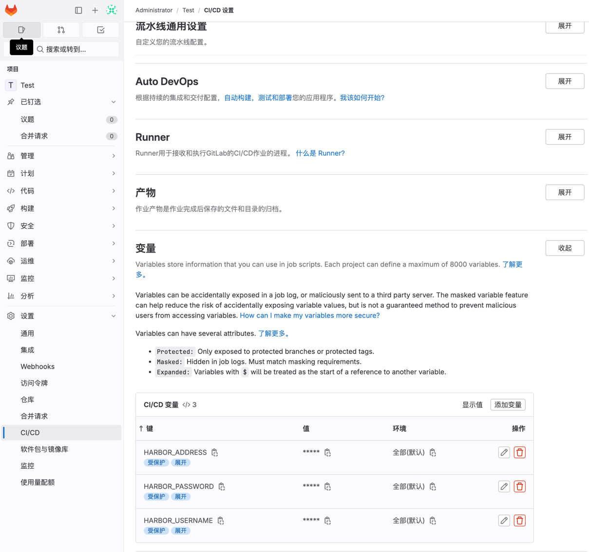

## 安装

进入服务器
user: 用户名, 默认为`root`
host: 主机, 例如`192.168.0.158`
```bash
ssh <user>@host
```

1. 创建gitlab的config配置目录
2. 创建gitlab的data数据目录
3. 创建gitlab的logs日志目录
```bash
mkdir -p /data/gitlab/config
mkdir -p /data/gitlab/logs
mkdir -p /data/gitlab/data
```

4. 安装Gitlab镜像, 根据需要安装
   客户端搜索`DockerHub`查询GitLab版本或者使用指令`docker search gitlab`查询, 本文使用gitlab最新版`gitlab:latest`镜像

格式:
-d: 后台运行
-e: 使用的时间
--name: 容器名
--restart: always, 不管容器是否为异常退出, 一直尝试重启
host: 主机, 例如`192.168.0.152`
http_port: 使用HTTP的端口,默认为`80`,
https_port: 使用HTTPS的端口,默认为`443`,
ssh_port: 使用 SSH克隆项目的端口, 默认为`22`
-v: 挂载宿主机目录至容器目录
```bash
docker run \
-d \
-h <host> \
-p <http_port>:<http_port>
-p <https_port>:<https_port>
-p <ssh_port>:<ssh_port> \
-e TZ=Asia/Shanghai \
--shm-size 256m \
--name gitlab \
--restart always \
-v /data/gitlab/config:/etc/gitlab \
-v /data/gitlab/logs:/var/log/gitlab \
-v /data/gitlab/data:/var/opt/gitlab \
gitlab/gitlab-ce:latest
```

示例:
```bash
mkdir -p /data/gitlab/config
mkdir -p /data/gitlab/logs
mkdir -p /data/gitlab/data

docker run -d \
-h 192.168.0.152 \
-p 80:80 \
-p 443:443 \
-p 2222:22 \
-e TZ=Asia/Shanghai \
--shm-size 256m \
--name gitlab \
--restart always \
-v /data/gitlab/config:/etc/gitlab \
-v /data/gitlab/logs:/var/log/gitlab \
-v /data/gitlab/data:/var/opt/gitlab \
gitlab/gitlab-ce:latest\
```


查看密码, 默认的账号是`root`:
```
cat /data/gitlab/config/initial_root_password
```
## 配置

### 基本配置

修改配置文件
```bash
vi /data/gitlab/config/gitlab.rb
```

格式:
external_url: Gitlab首页地址,服务器URL
gitlab_rails['gitlab_ssh_host']: 服务器URL
gitlab_rails['gitlab_shell_ssh_port']: Gitlab SSH地址端口

示例:
```rb
external_url 'http://192.168.0.152'
gitlab_rails['gitlab_ssh_host'] = '192.168.0.152' 
gitlab_rails['gitlab_shell_ssh_port'] = 2222 # Gitlab SSH地址
```

### 修改端口

> 可选, 如果想自定义端口, 就需要修改

#### 修改gitlab配置

修改配置文件
```bash
vi /data/gitlab/config/gitlab.rb
```

PROT: 端口
```rb
external_url 'http://192.168.0.152:<PROT>'
nginx['listen_port'] = <PROT>
```

#### 修改docker配置
如果Docker容器已经启动80端口,则更改Docker容器配置
参考 [[修改容器端口]]

把80端口改成你自己端口

#### 修改nginx配置

> 此方法为临时方法,gitlab重新读取配置文件后失效

将`gitlab.yml`文件的`port`改成你想设置的端口
```bash
vi /data/gitlab/data/gitlab-rails/etc/gitlab.yml
```

### 配置邮箱服务

修改以下注释部分, 替换成你的邮箱

> 如果修改完不生效, 尝试替换字段 `gitlab_rails['smtp_address']` 的值为 `"smtp.exmail.qq.com"`

```rb
gitlab_rails['smtp_enable'] = true
gitlab_rails['smtp_address'] = "smtp.qq.com"
gitlab_rails['smtp_port'] = 465
gitlab_rails['smtp_user_name'] = "xiconz@qq.com" # 邮箱
gitlab_rails['smtp_password'] = "cbkdgrnopljpjdichc" # 授权码
gitlab_rails['smtp_domain'] = "qq.com"
gitlab_rails['smtp_authentication'] = "login"
gitlab_rails['smtp_enable_starttls_auto'] = true
gitlab_rails['smtp_tls'] = true
gitlab_rails['smtp_pool'] = true
gitlab_rails['gitlab_email_from'] = 'xiconz@qq.com' # 邮箱
user['git_user_email'] ="xiconz@qq.com" # 邮箱
```

#### 测试邮件发送

格式:
```bash
Notify.test_email('exam@163.com','邮件标题','邮件内容').deliver_now
```

进入控制台发送测试邮件
```bash
gitlab-rails console
Notify.test_email('exam@163.com','邮件标题','邮件内容').deliver_now
```

### 配置SSH密钥

检查密钥是否存在
```bash
ls -alh ~/.ssh
```

不存在生成密钥:
```bash
ssh-keygen -t ed25519
```

或者:
```shell
ssh-keygen -t ed25519 -C "gitlab" -f ~/.ssh/gitlab_rsa
```
### **在Gitlab添加本机的`xxx.pub`秘钥**
![[img/Pasted image 20240214134828.png]]

### 添加私钥到本机SSH

添加私钥，指向私钥文件
```bash
ssh-add ~/.ssh/gitlab_rsa
```

失败使用:
```bash
ssh-agent bash
```

检查添加成功
```bash
ssh-add -l
```

#### 验证是否可以连接
```bash
ssh -T git@192.168.0.152 -p 2222
```
大写-T 指向主机
小写-p指向端口
选择-i指向密钥文件
-i ~/.ssh/gitlabpullweb_rsa

成功提示: `Welcome to GitLab, @wangbin!`

## 查看密码

> 如果忘记密码或者非手动修改密码时这个密码才有效

账号: root
```bash
sudo docker exec -it gitlab grep 'Password:' /etc/gitlab/initial_root_password
```

## 常用指令

>需要进入gitlab容器执行操作

- gitlab-ctl diff-config: 比较配置
-  gitlab-ctl reconfigure: 加载配置
-  gitlab-ctl restart: 重启
-  gitlab-ctl status: 查看状态

> gitlab-ctl reconfigure这个命令的作用，就是用gitlab.rb这个配置文件，来配置所有的组件，所以，当你更改了Gitlab的配置，就需要用这个命令来重新生成其他组件的配置文件。而如果没有更改过gitlab.rb，也就是配置没有更改，比如说，只更新了证书，那么就可以直接使用gitlab-ctl restart重启各种服务就行了。

## [可选]Gitlab-Runner

### 安装gitlab-runner
[参考](https://docs.gitlab.com/runner/install/docker.html)

[注意事项](https://www.cnblogs.com/newton/p/17408489.html)

```bash
img_name="runner4"
config="/mnt/data/158/gitlab-runner/${img_name}/config"
mkdir -p $config
docker run \
  -d \
  -v $config:/etc/gitlab-runner \
  --name $img_name \
  --restart always \
  --privileged=true \
  -v /var/run/docker.sock:/var/run/docker.sock \
  gitlab/gitlab-runner
```
参数说明:
- -v $config:/etc/gitlab-runner: 挂载runner的数据存储目录
- --name $img_name: 设置runner的docker名称
- --restart always: 重启策略, 不管遇到什么错误都总是重启
- --privileged=true: 特权模式, 当在gitlab CI中使用docker命令的[Docker in Docker](https://docs.gitlab.com/ee/ci/docker/using_docker_build.html), 都必须要使用特权模式 
-  -v /var/run/docker.sock:/var/run/docker.sock: 挂载宿主机的Docker, 这样就可以在runner里面不需要再次下载docker就可以调用docker命令
- gitlab/gitlab-runner: gitlab/gitlab-runner版本, 不加tag就是latest最新的版本

### 注册CICD通道
   [参考](https://docs.gitlab.com/runner/register/index.html#docker)
   `/data/gitlab-runner/confi`替换为你的`gitlab-runner/config`配置文件路径

建议注册一个Docker in Docker的Runner与你项目的环境, 
这里是前后项目, 使用到了go, node, docker这三个runner

#### 容器外注册
```bash
# Docker in Docker
# https://docs.gitlab.com/ee/ci/docker/using_docker_build.html
sudo gitlab-runner register -n \
  --url "https://gitlab.com/" \
  --registration-token REGISTRATION_TOKEN \
  --executor docker \
  --description "Docker in Docker 24.0.5" \
  --docker-image "docker:24.0.5" \
  --docker-privileged \ # privileged mode
  --docker-volumes "/certs/client" \

# Node
docker exec -it $img_name register \
  --non-interactive \
  --registration-token REGISTRATION_TOKEN \
  --url $url \
  --token "$token" \
  --executor "docker" \
  --docker-image node:18-alpine3.19 \
  --description "node" \

# Go
docker exec -it $img_name register \
  --registration-token REGISTRATION_TOKEN \
  --non-interactive \
  --url $url \
  --token "$token" \
  --executor "docker" \
  --docker-image golang:alpine \
  --description "go"
```
参数介绍:
- --registration-token REGISTRATION_TOKEN: 你在Gitlab界面创建Runner的Token
- --url $url: 你的Gitlab地址, 包含http, 例如: http://192.168.2.158:7080
- --executor docker: executor, 一般为shell或者docker和kubernetes居多, 这里是docker
- --docker-image "docker:24.0.5": 要按照的docker hub的镜像名, 包含版本, 这里是docker:24.0.5
- --docker-volumes "/certs/client": 如果要与其它的容器进行TLS通信, 这是必须的, 直接添加, 不需要修改
- -c value, --config value                   # 指定配置文件
- --template-config value                    # 指定模板配置文件
- --tag-list value                           # 指定runner的标签列表，逗号分隔
- -n, --non-interactive                      # 无交互进行runner注册
- --leave-runner                             # 如果注册失败，不用删除runner
- -r value, --registration-token value       # runner的注册token
- --run-untagged                             # 注册运行未加标签的构建，默认当标签列表为空时值为true
- --locked                                   # 锁定runner 默认true，锁定后就不能运行 job 了
- --access-level value                       # 设置访问等级 not_protected or ref_protected; 默认 not_protected
- --maximum-timeout value                    # 为作业设置最大运行超时时间 默认零 单位秒
- --paused                                   # 设置runner为 paused,默认 'false'
- --name value, --description value          # Runner 名称
- --limit value                              # 程序处理的最大构建数量default: "0"
- --output-limit value                       # 最大的构建大小单位kb default: "0"
- --request-concurrency value                # 作业请求的最大并发数 default: "0"
- -u value, --url value                      # GitlabCI服务器地址
- -t value, --token value                    # GitlabCI服务器token

### Gitlab命令行
- --user指定将用于执行构建的用户
- --working-directory  指定将使用 **Shell** executor 运行构建时所有数据将存储在其中的根目录
- gitlab-runner install --user=gitlab-runner --working-directory=/home/gitlab-runner
- gitlab-runner uninstall #该命令停止运行并从服务中卸载 GitLab Runner。
- gitlab-runner start     #该命令启动 GitLab Runner 服务。
- gitlab-runner stop      #该命令停止 GitLab Runner 服务。
- gitlab-runner restart   #该命令将停止，然后启动 GitLab Runner 服务。
- gitlab-runner status #此命令显示 GitLab Runner 服务的状态。当服务正在运行时，退出代码为零；而当服务未运行时，退出代码为非零。

#### 容器内交互式注册
1. 进入容器
```
docker exec -it <image-name> sh
```

2. 注册, 输入你在gitlab创建Runner的命令
```

```
3. 输入gitlab地址, 例如: http://192.168.2.158:7080
```shell

```
4. 输入配置文件名, 例如: config.toml, 默认即可

5. 输入executor, 如果是纯shell, 输入shell, 需要docker就填docker, 推荐填docker

6. 校验与重启
```shell
gitlab-runner verify
gitlab-runner restart
```
7. 退出容器
```
exit
```
8. 检查runner日志是否正常
```
docker logs -f <image-name>
```

### 编写配置文件(可选)
1. 查看是否生成配置文件
```bash
cat 你的runner目录/config.toml
```

2. (可选)添加Docker镜像加速
   关键字: `extra_hosts`
   [参考](https://docs.gitlab.com/runner/configuration/advanced-configuration.html)
   在`vi /<gitlab_runner_path>/config.toml`文件的`[runners.docker]`下添加

语法:
```
[runners.docker]
	...
	extra_hosts = ["<repo-url>:<Hosts that should be defined in container environment.>"]
```

示例:
```
[runners.docker]
	...
	extra_hosts =["docker.mirrors.sjtug.sjtu.edu.cn:127.0.0.1"]
```

遇到登录问题需要修改配置文件
```yml
  image: docker:stable  
  stage: build  
  script:  
    # 这里的变量会自动获取你当前推送代码的gitlab用户和密码以及仓库地址  
    - docker login --username $CI_REGISTRY_USER --password $CI_REGISTRY_PASSWORD $CI_REGISTRY  
    # 这里的变量就是我们全局配置定义的了  
    - docker build -t $IMAGE_FULL_NAME .  
    - docker push $IMAGE_FULL_NAME  
    - rm -rf target  
    - docker rmi $IMAGE_FULL_NAME  
  only:  
    - main # 只在当前分支执行runner作业 
  tags:
    - test
```

gitlab界面查看是否有这个CICD通道.
项目 -> 设置 -> CI/CD-> Runner -> 分配项目的 runner 是否与你注册时输入的步骤相关
![[Pasted image 20230223154159.png]]

.gitlab-ci.yml
[文档](https://docs.gitlab.com/ee/ci/yaml/index.html)

如果涉及到需要保密的变量, 可以在 项目-> 设置 -> CI/CD -> 变量 添加变量


然后再CI文件这样引用: ${var} 添加, 例如变量为 HARBOR_ADDRESS, 可以这样写: `$HARBOR_ADDRESS` 或者 `${HARBOR_ADDRESS}`, 示例:
```yaml
  script:
    - docker tag $IMAGE_TAG $HARBOR_ADDRESS/$HARBOR_REPO/$PROJECT_NAME:$IMAGE_TAG
    - docker push $HARBOR_ADDRESS/$HARBOR_REPO/$PROJECT_NAME:$IMAGE_TAG
```

```
stages:
  - init
  - build
  - deploy

cache:
  key: edu_system
  paths:
    - node_modules
    - dist

job_init:
  stage: init
  image: node:14-alpine
  tags:
    - edu-front-end
  script:
    - npm install pnpm -g
    - ls
    - cd ./web && pnpm install
    - cd ./client && pnpm install
    - ls
    - pnpm eslint:fix && pnpm stylelint:fix
    - pnpm build
  only:
    - main
  artifacts:
    paths:
      - dist/

# 打包Golang项目为二进制文件
job_build:
  stage: build
  image: golang # 利用Golang容器进行打包Golang项目
  tags:
    - edu-back-end
  script:
    - ls
    - go test ./test/
    - go env -w GOPROXY=https://proxy.golang.com.cn,direct
    - go get
    - go build -o app
    - chmod +x app

job_deploy:
  stage: deploy
  image: rockylinux
  only:
    - main
  tags:
    - edu-front-end
  script:
    - ls
    - yum makecache # 生成索引缓存索引提供搜索安装速度
    - yum install -y sshpass  openssh-clients # 下载`sshpass`,`openssh-clients`用于`SSH`登录服务器
    - cd web/dist && tar -czvf dist.tar.gz --exclude=node_modules ./* # 进入打包后的`dist`目录,对里面所有文件进行压缩,并排除`node_modules`,压缩后名文件为`dist.tar.gz`
    - export SSHPASS="$PASSWORD" # 设置生产服务器的密码的变量为`SSHPASS`,从gitlab的环境变量获取
    - ls
    - sshpass -e scp -o stricthostkeychecking=no config/dir.sh dist.tar.gz root@192.168.0.158:/home/nginx/html/web/ # 发送`dist.tar.gz`文件至生产服务器的`nginx`路径
    - sshpass -e ssh -o stricthostkeychecking=no root@192.168.0.158 'tar -xzvf /home/nginx/html/web/dist.tar.gz -C /home/nginx/html/web && rm -rf /home/nginx/html/web/dist.tar.gz' # 进入到生产服务器的`nginx`路径, 对`dist.tar.gz`文件进行解压, 解压完成后删除`dist.tar.gz`文件
    - sshpass -e scp -o stricthostkeychecking=no app .config/Dockerfile config/deploy.sh root@192.168.0.158:/home/nginx/html/web/temp # 发送go项目二进制文件与Dockerfile和deploy.sh
    - sshpass -e ssh -o stricthostkeychecking=no root@'192.168.0.158' 'cd /home/nginx/html/web/temp && bash deploy.sh' #部署go项目至Docker镜像

```

### submodules
[官方文档](https://docs.gitlab.com/ee/ci/git_submodules.html)

gitlab环境变量添加
```
GIT_SUBMODULE_STRATEGY: recursive
```

# 命令修改root密码
#执行命令

```
gitlab-rails console -e production      # 然后以此执行下面命令（需要提前查询用户的id号）
...> user = User.where(id: 1).first
...> user.password = 'root123*'
...> user.password_confirmation = 'root123*'
...> user.save!
```

```
例如，重置root用户密码为root123*，root用户id为1。

# gitlab-rails console -e production

irb(main):001:0> user = User.where(id: 1).first
=> #<User id:1 @root>
irb(main):002:0> user.password = 'root123*'
=> "root123*"
irb(main):003:0> user.password_confirmation = 'root123*'
=> "root123*"
irb(main):004:0> user.save!
Enqueued ActionMailer::DeliveryJob (Job ID: e562694d-2a1b-4bad-843b-d8567ac51077) to Sidekiq(mailers) with arguments: "DeviseMailer", "password_change", "deliver_now", #<GlobalID:0x00007fae7e55bcc8 @uri=#<URI::GID gid://gitlab/User/1>>
=> true
irb(main):005:0> quit
```

## 资料
1. [注意事项1](https://www.cnblogs.com/newton/p/17408489.html)
1. [注意事项2](https://blog.csdn.net/weixin_54104864/article/details/131381160)
2. .gitlab-ci.yaml配置解析 https://developer.aliyun.com/article/1313269
2. [.gitlab-ci.yaml全部配置](https://docs.gitlab.com/ee/ci/yaml/index.html)
3. runner高级配置 https://docs.gitlab.com/runner/configuration/advanced-configuration.html
4. docker运行runner https://docs.gitlab.com/runner/install/docker.html